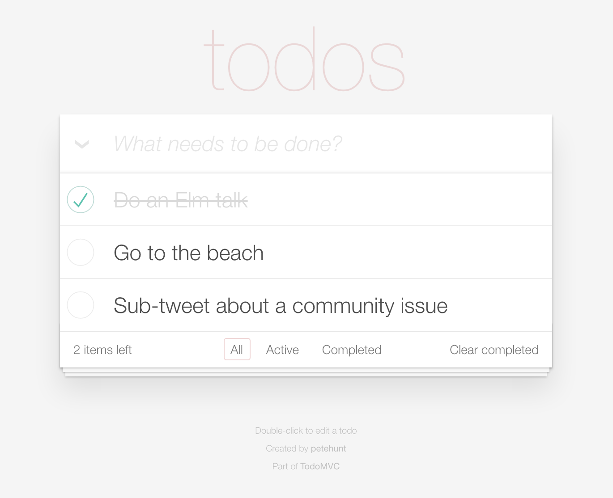
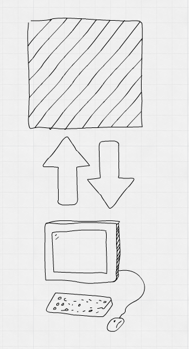
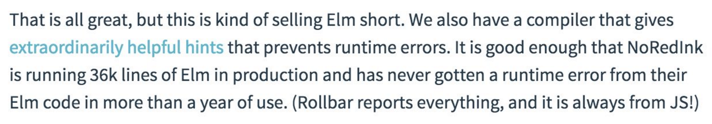
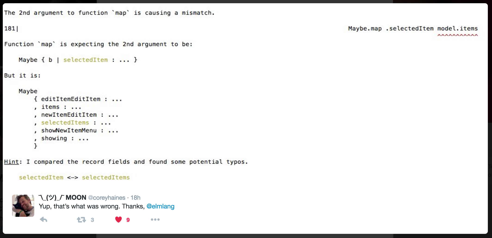
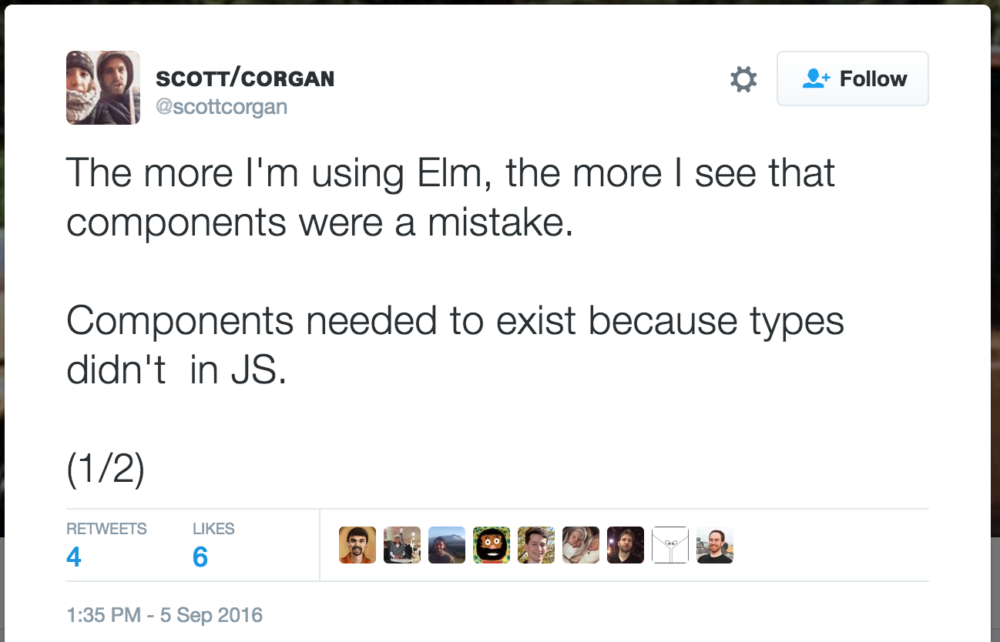

---


---

## @Jack_Franklin

---


---


---

## "Let's replicate rails"

---

## MVC / MVVC / MCVCVMMCVCCC

---

## Two way data binding and dirty checking

---

## `Object.observe`

---

> We can do better

---


---

## Changes in data

---

## The application owns its state

---

## Single source of truth

---

## `http://todo.com/filter/completed`

```js
{
  todos: [{ ... }, { ... }],
  filter: 'completed'
}
```

Duplicate knowledge = out of sync quickly!

---

## _Most_ state lives in one place, with exceptions.

---

> It Depends

---

## Our UI becomes a representation of state at a given time

---

```js
{
  todos: [{
      text: 'Do an Elm talk',
      done: true
    },
  ...
  ]
}
```



---

```js
{
  todos: [{
      text: 'Do an Elm talk',
      done: false
    },
  ...
  ]
}
```


---

```js
{
  todos: [{
      text: 'Do an Elm talk',
      done: true
    },
  ...
  ]
}
```


---

## Efficient rendering is not a developer concern[^1]

[^1]: within reason, not always, be reasonable, thanks!

---

## Explicitly define how the user can modify the state

---

## And be able to trace it

---

```javascript
angular.controller('MyCtrl', function($scope) {
    $scope.onClick = function() {
      $scope.x = $scope.x + 1;
    }

    function fetchDataAndIncrement() {
      fetch('api.com/data').then(function(data) {
        $scope.data = data;
        $scope.x = $scope.x + 1;
      });
    }
});
```

---

```js
function addTodo() {
  return {
    type: 'USER_ADD_TODO',
    text: 'Buy Milk'
  }
}
```

These can be logged, stored, tracked, serialized and so on.

---

## Have `update` functions that can handle actions and update the state

```
update(action, state) => newState
```

---

```javascript
const action = { type: 'USER_LOG_OUT'; };
const currentState = { user: { name: 'Jack' } };

const newState = update(action, currentState);

newState => { user: undefined };
```

---

## `update` encapsulates most business logic

---

## Your logic and your UI are separated

---

## Data flow


---




---

## Recommended Reading

:arrow_right: [Unidirectional User Interface Architectures](http://staltz.com/unidirectional-user-interface-architectures.html) by André Staltz

---


---

## Explictly deal with all user interactions and state changes

```js
function update(action, state) {
  switch (action.type) {
    case 'NEW_USER':
      return Object.assign({}, state, {
        user: { name: action.name }
      });
  }
}
```

---

## Even better!

```elm
type Msg =
  NewUser String
  | LogOut
```

---


---

## Elm: a _language_ to solve these problems.

---

## _Not_ the perfect language (yet?!)

---

## _Not_ the perfect solution to all our problems

---

* Functional
* Typed
* Compiled

---

* Expressive, clear code
* Self documenting
* Robust

---

> Learning curve ahead!

---

## Expressive, clear code

```elm
(add 1 2)
```

```elm
List.map (\x -> x + 2) [1, 2, 3, 4]
```

```elm
List.map ((+) 2) [1, 2, 3, 4]
```

---

## Pipes

```elm
incrementWeight (incrementHeight (incrementAge (makePerson "jack")))

makePerson "jack"
|> incrementAge
|> incrementHeight
|> incrementWeight
```

---

# 😢

```elm
makePerson "jack"
|> incrementAge
|> incrementHeight
|> incrementWeight
|> incrementWeight
|> incrementWeight
|> incrementWeight
|> incrementWeight
|> incrementWeight
|> incrementWeight
|> incrementWeight
|> incrementWeight
|> incrementWeight
|> incrementWeight
```


---

```elm
incrementAge person =
  { person | age = person.age + 1 }


add x y = 
  x + y

addTwo =
  add 2
```

---

## Self documenting

---

## Types

```elm
add : Int -> Int -> Int
add x y =
  x + y

isEven : Int -> Bool
isEven x =
  n % 2 == 0
```

---

## Union Types

```elm
type Filter
  = ShowAll
  | ShowCompleted
  | ShowActive

```

---

```elm
type Filter
  = ShowAll
  | ShowCompleted
  | ShowActive

showTodos : Filter -> List Todo -> List Todo
showTodos filter todos =
  case filter of
    ShowAll -> todos
    ShowCompleted -> List.filter (\t -> t.complete) todos
    ShowActive -> List.filter (\t -> not t.complete) todos
```

---

## Union Types

:+1: They can be checked by the compiler (typos are spotted)

:+1: Compiler ensures all are dealt with in `case ... of`

:+1: Easy to change / add a new one: add it and fix each compiler error!

---

## Type aliases

```elm
type alias Person = 
  { name : String
  , age : Int
  }

incrementAge : Person -> Person
incrementAge person =
  { person | person.age = person.age + 1 }
```

---

:+1: Clearer code, typed in your domain specific objects.

:+1: Compiler can guarantee you're meeting the type requirements.

:+1: No more 'undefined is not a function' !

---

## Robust

---

## Immutability brings guarantees

```js
var person = { name: 'Jack', age: 24 };

incrementAge(person);

// has this mutated?
// does it return a new person?
```

---


---

## Sweet, sweet Elm

```elm
let
  person = { name = "Jack", age = 24 }
in
  incrementAge person
```

:+1: `person` is untouched
:+1: `incrementAge` has to return a new person
:+1: goodbye mutation bugs

---

## Pure Functions

Elm functions are always pure.

```js
let sum = (a, b) => a + b; //PURE
sum(2, 2) // => ALWAYS 4

let otherSum = (a, b) => window.foo + a + b; //IMPURE
otherSum(2, 2) // => who knows, dependent on window.foo
```

---

## Dealing with nothing

---

> I call it my billion-dollar mistake.

---

> It was the invention of the null reference in 1965.

---

> This has led to innumerable errors, vulnerabilities, and system crashes

-- Tony Hoare

---

## No null: how do you represent a value being present _or_ empty?

---

```js
render() {
  return <p>{ this.props.apiData.username }</p>;
}
```

---

## Maybe

---

## Maybe

```elm
type Maybe a =
  Just a
  | Nothing

```

It's either `Just` some value, or `Nothing`.

---

As a value, I am:

- __Just__ the integer 5
- or, I am __Nothing__

I have the type `Maybe Int`

---

Get the first thing from the list, and double it[^2]

```elm
let list = [1, 2, 3] in
	(List.head list) * 2
```

But what if `list = []` ?

[^2]: this code is not valid Elm, becuase `List.head` returns `Maybe`

---

# ‼️

---

## Maybe

```elm
type alias Model = {
  user : Maybe User
}

view : Model -> Html Msg
view model =
  case model.user of 
    Nothing ->
      div [] [ text "No user!" ]
    Just user ->
      div [] [ text ("Logged in as " ++ user.name) ]
```

---

## You must handle all cases of missing / pending data

---

## Task

A module for async actions that might fail (HTTP).

```elm
Task errType successType
```

```elm
Task String User
- if it fails, fail with a String
- if it succeeds, succeed with a User
```

---

## Commands

an async thing that Elm should run for you (HTTP requests)

---

## Learning curve!

---

> The Elm compiler make sure that 100% of your code is thoroughly checked against corner cases and error cases. This everywhereness becomes a guarantee. And it is only because of this guarantee that Elm programs have virtually no runtime errors.

-- [Everywhereness as a Foundation](http://staltz.com/everywhereness-as-a-foundation.html), André Staltz

---



---



---

## Building actual apps in Elm

---

## The Elm Architecture

---

The three parts:

```elm
model : Model
view : Model -> Html Msg
update : Msg -> Model -> Model
```
---

## What changed?

---


---

## Building a counter app

---

First, define your `Model`

```elm
type alias Model = Int

initialModel : Model
initialModel = 0
```

---

Secondly, define your `Msg`s

```elm
type Msg = Increment | Decrement
```

---

Thirdly, define your `update`:

```elm
update : Msg -> Model -> Model
update msg model =
  case msg of 
    Increment -> model + 1
    Decrement -> model - 1
```

---

Fourthly, define your `view`:

```elm
view : Model -> Html Msg
view model =
  div []
    [ button [ onClick Decrement ] [ text "-" ]
    , div [] [ text (toString model) ]
    , button [ onClick Increment ] [ text "+" ]
    ]
```
---

Finally, hook it all up!

```elm
main =
  Html.App.beginnerProgram
    { model = initialModel
    , view = view
    , update = update
    }
```

---


---

:+1: We left the `view` until last.
:+1: Explained all our logic before the UI.
:+1: Notice how easy `update` would be to test.

---

## Side Effects

---

### Explicitly model side effects.

Hand off to Elm, it will hand back later.

Keeps functions pure, and async easier to reason about.

---

## Commands

---

Whenever you need to perform some background work, you have to give Elm a command.

Elm will go off, perform the command, and call your `update` function once it's done.

---

## The Elm Architecture, Part 2

---

```elm
model : Model
view : Model -> Html Msg
update : Msg -> Model -> (Model, Cmd Msg)
```

---


---

## Fetching someone's GitHub data.

---

Firstly, define the model:

```elm
type alias GithubPerson =
  { name : String
  , company : String
  }

type alias Model =
  { username : String
  , githubPerson : Maybe GithubPerson
  }
```

---

Secondly, define your `Msg`s

```elm
type Msg
  = NewGithubData (Result Http.Error GithubPerson)
  | FetchGithubData
```

---

Thirdly, define your `update`:

```elm
update : Msg -> Model -> ( Model, Cmd Msg )
update msg model =
    case msg of 
        NewGithubData (Ok person) ->
            ( { model | githubPerson = Just person }, Cmd.none )

        NewGithubData (Err _) ->
            ( model, Cmd.none )

        FetchGithubData ->
            ( model, fetchGithubData model.username )
```

---

```elm
NewGithubData (Ok person) ->
  ( { model | githubPerson = Just person }, Cmd.none )

-- Cmd.none === do nothing
```

---

```elm
FetchGithubData ->
  ( model, fetchGithubData model.username )

--- fetchGithubData returns a command
--- which Elm will run for us
```

---


---

Fourthly, define your `view`:

```elm
view : Model -> Html Msg
view model =
  case model.githubPerson of
    Just person ->
      div []
        [ text (person.name ++ ", " ++ person.company) ]
    Nothing ->
      div [] [
        button [ onClick FetchGithubData ] [ text "Load!" ]
      ]
```

---

Fifthly (new step), define  your `init`:

```elm
initialModel : Model
initialModel =
  { username = "jackfranklin"
  , githubPerson = Nothing
  }


init : ( Model, Cmd Msg )
init =
  ( initialModel, Cmd.none )
```

---

Finally, hook it all together!

```elm
main = 
  Html.program
    { init = init
    , view = view
    , update = update
    , subscriptions = \_ -> Sub.none
    }
```

---


---


---


---


---


---


---


---

## Deep breath!

---

> That feels like a lot of code to do something so simple

-- All of you.

---

> Boilerplate vs Explicitness

---

> Benefits increase as application grows

Which is often where JavaScript starts to struggle.

---

### `jackfranklin/elm-for-js-developers-talk`

---


## Components...ish?

---




---

## The Elm Ecosystem

---

## `elm reactor`

---

## `elm package`

---


---

## There's so much more I haven't covered.

---

> So, why / when should you use Elm?

---

> You're fed up of `undefined function` errors that take up loads of time

---

> You want to develop with the confidence of Types and a clever compiler to back you up

---

> You're happy to "ride the wave" and deal with a language still growing and settling down

---

> You're happy to build more packages than depend on existing solutions which may not exist in Elm

---

## But what if this talk has put me off Elm?

---

## Elm does take time to learn, so please don't give up after 30 minutes of slides!

### guide.elm-lang.org

---

## Elm the language brings many concepts that are language agnostic

---

## The Elm Architecture

---

## Explicitness across your application

---

## Types

---

## Immutability / Functional Programming

---

## Defining your application step by step

1. Define your model.
2. Define your actions.
3. Define your update function.
4. Define your view.
5. Repeat.

---

## Will everyone be writing Elm in 1/2/5 years?

---

> It Depends

---

> But it's great fun!

---


- guide.elm-lang.org

- elm-lang.org/docs

- elm-lang.org/community

- github.com/jackfranklin/elm-for-js-developers-talk

- speakerdeck.com/jackfranklin

---

## @Jack_Franklin

### javascriptplayground.com
