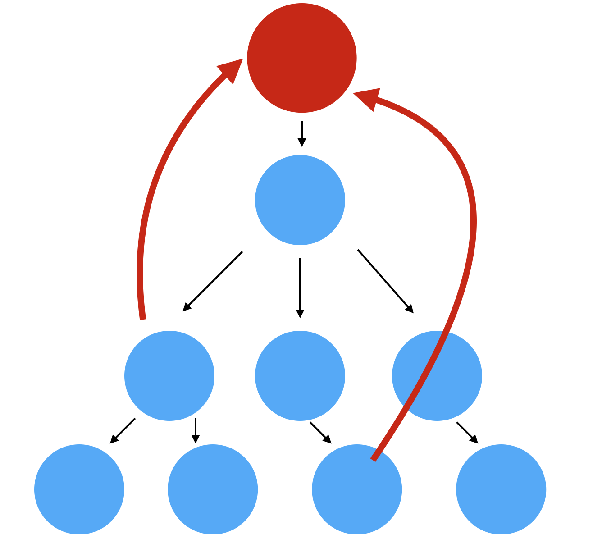
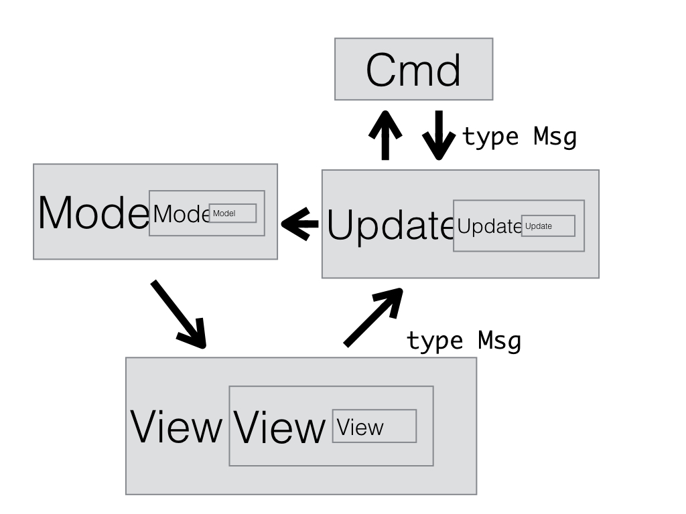
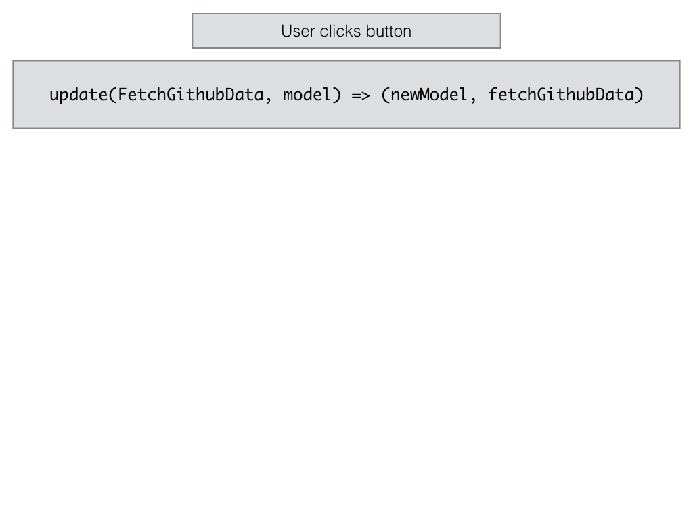
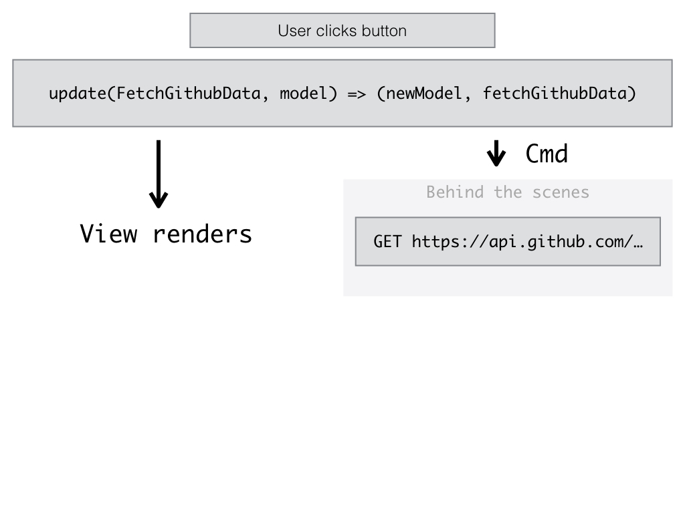
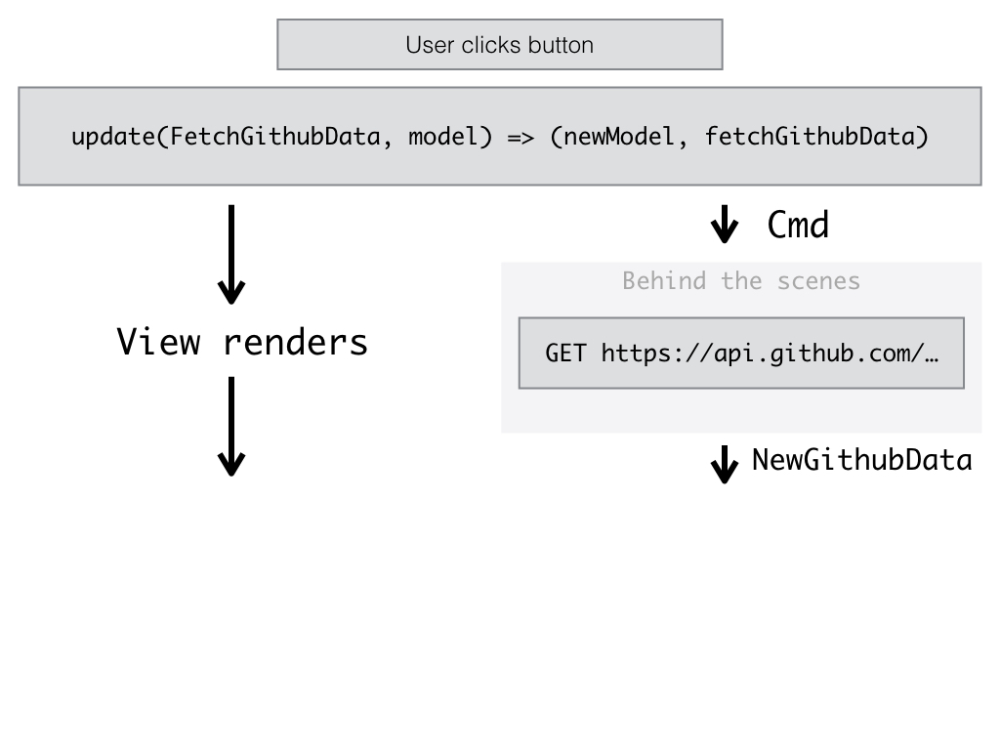
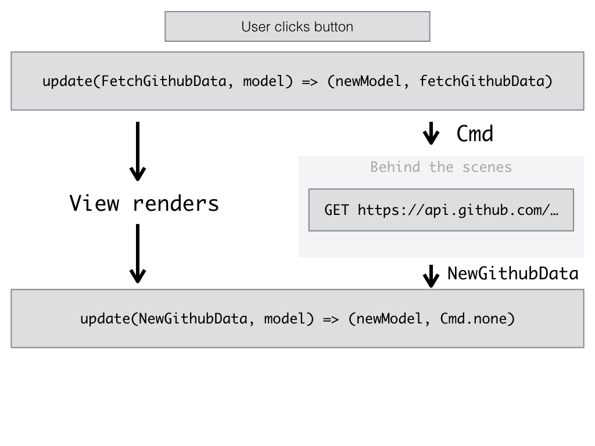
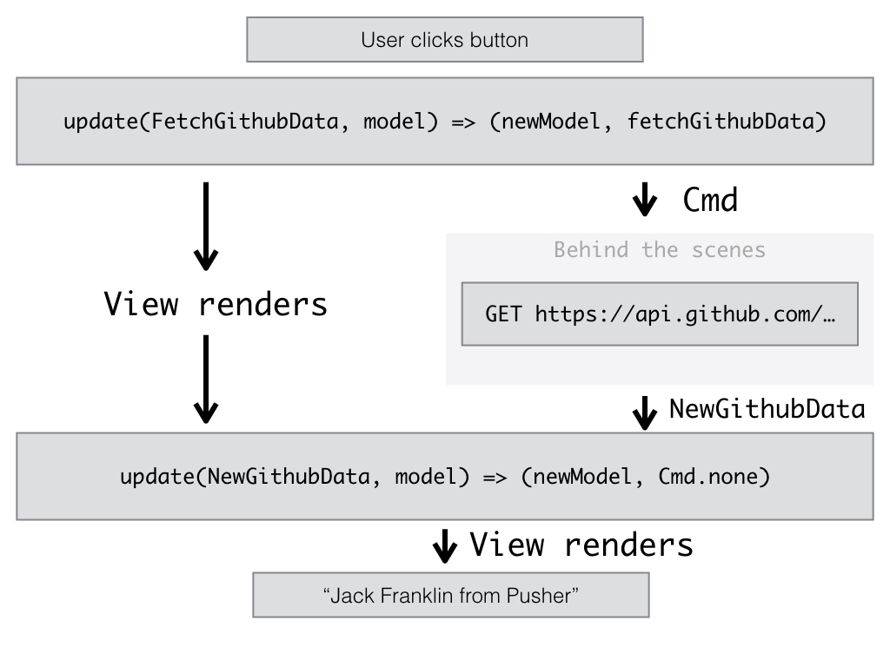

footer: @Jack_Franklin, bit.ly/elm-polyconf
slidenumbers: true


---

# 🇵🇱

---


---

## @Jack_Franklin

---


---


---


---

## The great tooling problem

---

## We must accept that complex applications are _hard_ to build

---

## Trends in Complex JavaScript Applications

---

## Two Way Data Binding

---

## `Object.observe`

---

## MVC / MVVC / MCVCVMMCVCCC

---

## "Let's replicate Rails"

---

> We can do better

---

## Explicit, component based approach

---


---

## Components in some form

- Angular 2
- Ember
- Vue.js
- Cycle.js
- React

---

## Who actually likes JavaScript these days?!

---

## Explicit about state

---

## Single source of truth

---

## Views represent state<br><br>

## `view(state) => HTML`

---

## View functions are pure<br><br>

## `view(state1) => HTML1`
## `view(state1) => HTML1`
## `view(state2) => HTML2`

---

## Explicitly define all actions that can modify state

```js
function addTodo() {
  return {
    type: 'USER_ADD_TODO',
    text: 'Buy Milk'
  }
}
```

---

## Have `update` functions that can handle actions

```
update(action, state) => newState
```

---

## `update` encapsulates most business logic

---

## Unidirectional Data Flow

```
user clicks
-> action
-> update(action, state)
-> view(newState)
```

---

## Recommended Reading

:arrow_right: [Unidirectional User Interface Architectures](http://staltz.com/unidirectional-user-interface-architectures.html) by André Staltz

---



---


## Explicit vs Magic

---

## Magic!

```js
function setNewUser(name) {
  $scope.user = { name : 'jack' };
}
```
---

## Explicit!

```js
function update(action, state) {
  switch (action.type) {
    case 'NEW_USER':
      return Object.assign({}, state, {
        user: { name: action.name }
      });
  }
}
```

---

## Even more explicit!

```
type Msg =
  NewUser String
  | LogOut
```

---

## Even more explicit because the compiler says so

```
update msg model =
  case msg of
    NewUser name ->
      { model | user = name }
```

```
This `case` does not have branches for all possibilities.

22|>    case msg of

You need to account for the following values:

    LogOut

Add a branch to cover this pattern!
```

---


---

## Elm: a _language_ to solve these problems.

---


> Elm, my Dear Watson

-- Sherlock Holmes

---

## _Not_ the finished article

---

## _Not_ the perfect language (yet?!)

---

## _Not_ the perfect solution to all our problems

---

## _No_ runtime errors!

---

* Functional
* Typed
* Compiled

---

* Expressive, clear code
* Self documenting
* Robust

---

> Learning curve ahead!

---

## Expressive, clear code

---

## Functional Programming

```js
add(1, 2)
```

```
(add 1 2)
```

```
List.map (\x -> x + 2) [1, 2, 3, 4]
```

```
List.map ((+) 2) [1, 2, 3, 4]
```

---

## Pipes

```
incrementWeight (incrementHeight (incrementAge (makePerson "jack")))

makePerson "jack"
|> incrementAge
|> incrementHeight
|> incrementWeight
```

---

## Clean syntax

```
incrementAge person =
  { person | age = person.age + 1 }


add x y = 
  x + y

addTwo =
  add 2
```

---

## Self documenting

---

## Types

```
add : Int -> Int -> Int
isEven : Int -> Bool
```

---

## Union Types

```
type Filter
  = ShowAll
  | ShowCompleted
  | ShowActive

showTodos : Filter -> List Todo -> List Todo
showTodos filter todos =
  case filter of
    ShowAll -> todos
    ShowCompleted -> List.filter (\t -> t.complete) todos
    ShowActive -> List.filter (\t -> not t.complete) todos
```

---

## Union Types

:+1: They can be checked by the compiler (typos are spotted)

:+1: Compiler ensures all are dealt with in `case ... of`

:+1: Easy to change / add a new one: add it and fix each compiler error!

---

## Type aliases

```
type alias Person = 
  { name : String
  , age : Int
  }

incrementAge : Person -> Person
incrementAge person =
  { person | person.age = person.age + 1 }
```

---

:+1: Clearer code, typed in your domain specific objects.

:+1: Compiler can guarantee you're meeting the type requirements.

:+1: No more 'undefined is not a function' !

---

```
type alias Person = 
  { name : String
  , age : Int
  }
```


---

## Robust

---

## Immutability brings guarantees

```js
var person = { name: 'Jack', age: 24 };

incrementAge(person);

// has this mutated?
// does it return a new person?
// #javascript
```

---

## Sweet, sweet Elm

```
let
  person = { name = "Jack", age = 24 }
in
  incrementAge person
```

:+1: `person` is untouched
:+1: `incrementAge` has to return a new person
:+1: goodbye mutation bugs

---

## Modules

:+1: Everything is scoped

:+1: Modules explicitly declare what they expose

:+1: Modules explicitly declare what they import

---

## Dealing with nothing

No more null.

---

## Maybe

```
type Maybe a =
  Just a
  | Nothing

```

It's either `Just` some value, or `Nothing`.

---

## Maybe

```
type alias Model = {
  user : Maybe User
}

view : Model -> Html Msg
view model =
  case model.user of 
    Nothing ->
      div [] [ text "No user!" ]
    Just user ->
      div [] [ text ("Logged in as " ++ user.name) ]
```

---

## You must handle all cases of missing / pending data

---

## Task

A module for async actions that might fail (HTTP).

```
Task errType successType
```

```
Task String User
- if it fails, fail with a String
- if it succeeds, succeed with a User
```

---

## You have to deal with errors.

`Task` doesn't let you not.

(We'll come back to this later).

---

## Commands and Subcriptions

- `Cmd` : an async thing that Elm should run for you
- `Sub` : a subscription to some data you care about that might change

(We'll come back to these).

---

## Adjustment time

This does take time to get used to

* Syntax
* Types
* Immutablility
* Compiling!
* `Maybe` and explicit error handling

---

> When you apply a pattern everywhere it ends up becoming a guarantee: that 100% of your code will follow that pattern. Once you have that guarantee you can build powerful developer tools or cross module features.

-- [Everywhereness as a Foundation](http://staltz.com/everywhereness-as-a-foundation.html), André Staltz

---

> The Elm compiler make sure that 100% of your code is thoroughly checked against corner cases and error cases. This everywhereness becomes a guarantee. And it is only because of this guarantee that Elm programs have virtually no runtime errors.

-- [Everywhereness as a Foundation](http://staltz.com/everywhereness-as-a-foundation.html), André Staltz

---

## The Elm Architecture

---

The three parts:

```
model : Model
view : Model -> Html Msg
update : Msg -> Model -> Model
```

---


---

## Counter

---

First, define your `Model`

```
type alias Model = Int

initialModel : Model
initialModel = 0
```

---

Secondly, define your `Msg`s

```
type Msg = Increment | Decrement
```

---

Thirdly, define your `update`:

```
update : Msg -> Model -> Model
update msg model =
  case msg of 
    Increment -> model + 1
    Decrement -> model - 1
```

---

Fourthly, define your `view`:

```
view : Model -> Html Msg
view model =
  div []
    [ button [ onClick Decrement ] [ text "-" ]
    , div [] [ text (toString model) ]
    , button [ onClick Increment ] [ text "+" ]
    ]
```
---

Finally, hook it all up!

```
main =
  Html.App.beginnerProgram
    { model = initialModel
    , view = view
    , update = update
    }
```

---


---

:+1: We left the `view` until last.
:+1: Explained all our logic before the UI.
:+1: Notice how easy `update` would be to test.

---

## Side Effects

---

### Explicitly model side effects.

Hand off to Elm, it will hand back later.

---

## Commands

---

Whenever you need to perform some background work, you have to give Elm a command.

Elm will go off, perform the command, and call your `update` function once it's done.

---

```
model : Model
view : Model -> Html Msg
update : Msg -> Model -> (Model, Cmd Msg)
```

---



---

## Fetching someone's GitHub data.

---

Firstly, define the model:

```
type alias GithubPerson =
  { name : String
  , company : String
  }

type alias Model =
  { username : String
  , githubPerson : Maybe GithubPerson
  }
```

---

Secondly, define your `Msg`s

```
type Msg
  = NewGithubData GithubPerson
  | FetchGithubData
  | FetchError Http.Error
```

---

Thirdly, define your `update` (and note the new type)

```
update : Msg -> Model -> ( Model, Cmd Msg )
update msg model =
  case msg of
    FetchError error ->
      -- deal with error here in reality

    NewGithubData person ->
      ( { model | githubPerson = Just person }, Cmd.none )

    FetchGithubData ->
      ( model, fetchGithubData model.username )
```

---

```
NewGithubData person ->
  ( { model | githubPerson = Just person }, Cmd.none )

-- Cmd.none === do nothing

FetchGithubData ->
  ( model, fetchGithubData model.username )

--- fetchGithubData returns a command
--- which Elm will run for us
```

---


---

Fourthly, define your `view`:

```
view : Model -> Html Msg
view model =
  case model.githubPerson of
    Just person ->
      div []
        [ text (person.name ++ ", " ++ person.company) ]
    Nothing ->
      div [] [
        button [ onClick FetchGithubData ] [ text "Load!" ]
      ]
```

---

Fifthly (new step), define  your `init`:

```
initialModel : Model
initialModel =
  { username = "jackfranklin"
  , githubPerson = Nothing
  }


init : ( Model, Cmd Msg )
init =
  ( initialModel, Cmd.none )
```

---

Finally, hook it all together!

```
main = 
  Html.App.program
    { init = init
    , view = view
    , update = update
    , subscriptions = \_ -> Sub.none
    }
```

---


---


---



---



---



---



---



---

> That feels like a lot of code / effort!

-- All of you.

---

> Boilerplate vs Explicitness

---

> Benefits increase as application grows

---

## Fetching Data

- Decoding JSON from an API into an Elm record.
- Use Elm's HTTP library to make the request.
- Code in the GitHub repo!
- Come and grab me if you'd like to see it in person.

---

### `http://bit.ly/elm-polyconf`

---

## Scaling your application

---


---

## The Elm Ecosystem

---

## `elm reactor`

Easily run a project in the browser with no tooling required.

---


---

## `elm package`

---


---

Semantic versioning ensured.

```
~/git/elm-statey > elm package diff
Comparing jackfranklin/elm-statey 2.0.0 to local changes...
This is a MAJOR change.

------ Changes to module Statey - MAJOR ------

    Changed:
      - makeState : String -> Statey.State
      + makeState : Statey.State

```

---

## `elm format`

---

## There's so much more I haven't covered.

---

> So, why / when should you use Elm?

---

> You're fed up of `undefined function` errors that take up loads of time

---

> You're fed up of packages on npm breaking semantic versioning

---

> You want to develop with the confidence of Types and a clever compiler to back you up

---

> You're happy to "ride the wave" and deal with a language still growing and settling down

---

> You're happy to build more packages than depend on existing solutions which may not exist in Elm

---

# But what if this talk has put me off Elm?

---

## Elm does take time to learn, so please don't give up after 30 minutes of slides!

### guide.elm-lang.org

---

## Elm the language brings many concepts that are language agnostic

---

## The Elm Architecture

---

## Explicitness across your application

---

## Types

---

## Immutability / Functional Programming

---

## Defining your application step by step

1. Define your model.
2. Define your actions.
3. Define your update function.
4. Define your view.
5. Repeat.

---

## Will everyone be writing Elm in 1/2/5 years?

---


---

- guide.elm-lang.org

- elm-lang.org/docs

- elm-lang.org/community

- **bit.ly/elm-polyconf**

- speakerdeck.com/jackfranklin

---

# @Jack_Franklin

## javascriptplayground.com

---


